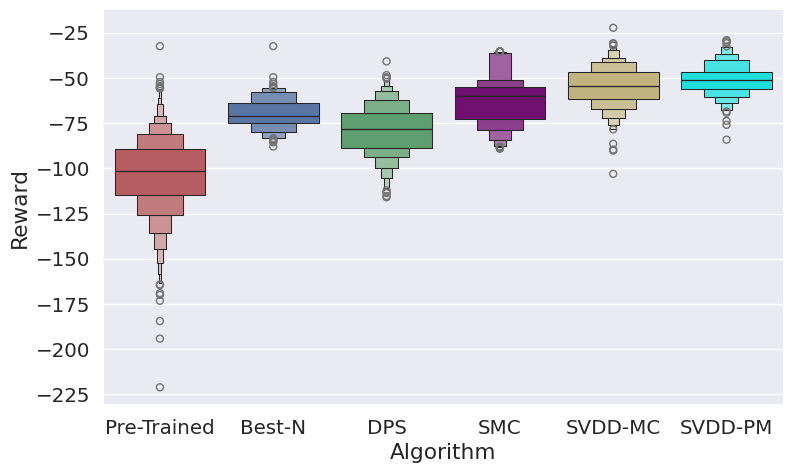
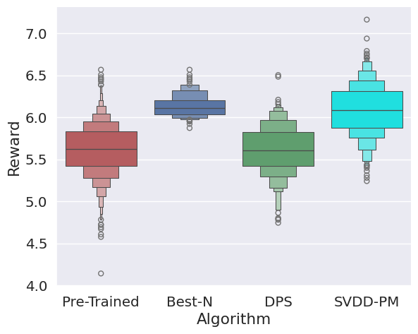

# Derivative-Free Guidance in Diffusion Models with Soft Value-Based Decoding for Images 

This code accompanies the paper on soft value-based decoding in diffusion models, where the objective is to maximize downstream reward functions in diffusion models. In this implementation, we focus on generating **images** with high scores. For **biological sequences**, refer to [here](https://github.com/masa-ue/SVDD). 


### Compressbiltiy 

Here, the pre-trained model is a stable diffusion model. We optimize compressbiltiy.  

Run the following: 

```
CUDA_VISIBLE_DEVICES=0 python inference_decoding_all.py --reward 'compressibility'  --guidance 0.0 --bs 3 --num_images 3 --duplicate_size 20 
```

Here is a result. 



### Aesthetic score  

Here, the pre-trained model is a stable diffusion model. We optimize compressbiltiy. We optimize asthetic predictors.  

Run the following 

```
CUDA_VISIBLE_DEVICES=0 python inference_decoding_all.py --reward 'compressibility'  --guidance 0.0 --bs 3 --num_images 3 --duplicate_size 20 
```
Here is a result. 




### Remark 

We have adopoted the code from  


### Requirements

Actually I recommend directly using the `alignprop` env rather than following the command below 

```
pip install -r requirements.txt
```
